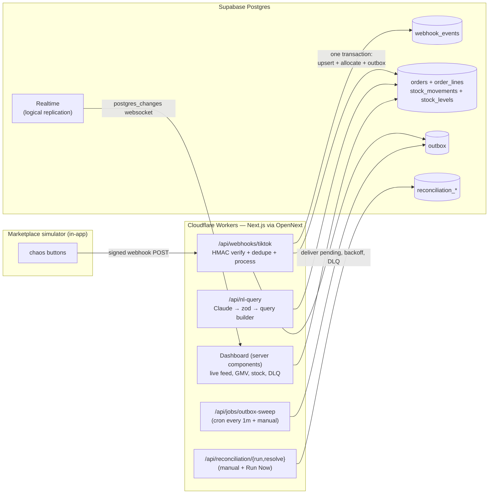

# Commerce OS

Hardened multi-brand inventory + order ledger for marketplace commerce (TikTok Shop et al). Interview proof-of-concept for Platinum Commerce, built in 5 days.

**Positioning:** the foundation of the "Platinum OS" you'd propose, on the exact stack described in the JD — Next.js App Router (TypeScript) via OpenNext on Cloudflare Workers, Supabase Postgres, `supabase-js` with generated types, zod, shadcn-style Tailwind, Vitest. This repo is the skeleton the real product would be hardened and grown from — not a competitor.

Live worker (untouched Next.js scaffold from Day 1): https://commerce-os.singhkudrat59.workers.dev/

Repo: https://github.com/kudratsingh/commerce-os

---

## The demo in one screen

Two pages, both server-rendered against append-only SQL truth. Every number on the dashboard traces back to a named view (`dashboard_summary`, `stock_dashboard`, `dlq_events`, `recent_orders`); every button on the simulator hits a real HTTP route.

- **`/`** — ops dashboard: stat strip (GMV today, backordered, ingested, processed, failed, dead), stock table with `low_stock` badges, live order feed via Supabase Realtime `postgres_changes`, DLQ panel with per-row Retry.
- **`/simulator`** — nine chaos buttons that sign payloads server-side and fire at this worker's own webhook; reconciliation Run + Resolve; NL query bar (question → JSON filter spec → typed supabase-js chain — the model never emits SQL).

---

## Architecture



The full walkthrough (sequence diagrams for every scenario, worker-layer discussion, scale path, security model) is in [`docs/architecture.md`](./docs/architecture.md). The mental model in merchant terms is in [`docs/domain-model.md`](./docs/domain-model.md).

---

## The nine invariants (in [`CLAUDE.md`](./CLAUDE.md))

Violating any of these is a bug, full stop. In summary:

1. `stock_movements` is APPEND-ONLY — enforced by trigger, corrections are new `adjustment` rows.
2. `stock_levels` is mutated only by domain functions in Postgres.
3. `CHECK (committed <= on_hand)` is un-bypassable — oversell is a DB error, not a support ticket.
4. Every webhook is idempotent — event-level dedupe via `ON CONFLICT DO NOTHING`, duplicates return **200 `{deduped:true}`** (never 4xx — see [ADR-004](./docs/adr/ADR-004-idempotency-strategy.md)).
5. All money is integer cents. Zero floats near money or quantities.
6. Every external payload passes `zod.safeParse` before touching the DB.
7. The NL query feature NEVER emits SQL. Model → JSON spec → zod → hand-written builder over an allowlist ([ADR-007](./docs/adr/ADR-007-nl-query-safety.md)).
8. `SUPABASE_SERVICE_ROLE_KEY` is server-only; client gets anon key + RLS.
9. Timestamps are `timestamptz`, UTC in the DB, formatted at the edge.

The six executable proofs live in [`db/tests/invariants.sql`](./db/tests/invariants.sql). CI's `db-invariants` job replays them on a fresh `postgres:16` container after applying every migration from zero.

---

## Quickstart

**Prereqs:** Node 22+, pnpm 9+, Docker (for local Supabase), Supabase CLI, Wrangler is a devDependency.

```bash
git clone https://github.com/kudratsingh/commerce-os.git && cd commerce-os
pnpm install
supabase start                    # local Supabase on 54321-54324, ~30s
cp .dev.vars.example .dev.vars    # local supabase keys are the same for everyone
# also mirror to .env.local for `pnpm dev` (see .dev.vars.example)
pnpm gen:types                    # regenerate lib/db/database.types.ts from live schema
pnpm seed:demo                    # reset + apply supabase/demo-seed.sql (see below)
pnpm dev                          # http://localhost:3000 (or 3001 if that's taken)
```

The dashboard opens with real state — 30 seeded orders across 3 days, some shipped, two DLQ entries (unknown SKU + cancel-before-create), one open channel drift on `LM-AIR-2`. No fires needed for the initial paint to look alive.

**Anthropic key** for the NL query bar (optional; the endpoint 503s cleanly without it):

```bash
echo 'ANTHROPIC_API_KEY=sk-ant-...' >> .env.local
echo 'ANTHROPIC_API_KEY=sk-ant-...' >> .dev.vars
```

---

## Commands

| | |
|---|---|
| `pnpm dev` | `next dev` — fast local loop |
| `pnpm preview` | `opennextjs-cloudflare build && opennextjs-cloudflare preview` — workerd, real fidelity |
| `pnpm deploy` | build + deploy to Cloudflare Workers |
| `pnpm build` | production build |
| `pnpm lint` / `pnpm typecheck` / `pnpm test` | quality gate; runs in CI |
| `pnpm test:integration` | Vitest against local Supabase (5 files, 34 tests) |
| `pnpm gen:types` | regenerate `lib/db/database.types.ts` — run after EVERY migration |
| `pnpm seed:demo` | fresh reset + realistic seed for the dashboard |
| `pnpm sim:fire <scenario>` | CLI mirror of the chaos buttons (one · burst · duplicate · unknown-sku · overshoot · malformed · bad-signature · invalid-json) |
| `supabase start` / `supabase db reset` / `supabase migration new <name>` | Supabase local + migrations |
| `psql "$LOCAL_DB_URL" -f db/tests/invariants.sql` | run the six invariant tests locally |

---

## Documentation

Deep docs live in [`docs/`](./docs); read on demand:

| Read this | When |
|---|---|
| [`CLAUDE.md`](./CLAUDE.md) | Operating manual, invariants, doc routing |
| [`BUILD_PLAN.md`](./BUILD_PLAN.md) | 5-day plan, webhook contract, 7-min demo script |
| [`ROADMAP.md`](./ROADMAP.md) | Post-demo module sequencing (leave-behind for the interviewer) |
| [`docs/domain-model.md`](./docs/domain-model.md) | What each request means in merchant terms |
| [`docs/architecture.md`](./docs/architecture.md) | Top-to-bottom system design with Mermaid diagrams |
| [`docs/technology-primer.md`](./docs/technology-primer.md) | New stack mapped to the incident platform |
| [`docs/engineering-workflow.md`](./docs/engineering-workflow.md) | Branching, PRs, CI/CD |
| [`docs/adr/`](./docs/adr) | Eight decision records — interview flashcards |

---

## Testing

Two CI jobs run on every PR and push to `main`:

1. **Lint, typecheck, test, build** — Node 22, pnpm 9. Runs unit tests (`vitest run --passWithNoTests`), not the integration suite (which needs a live Supabase).
2. **Migrations from zero + invariant tests** — spins a `postgres:16` service container, stubs Supabase's `auth.jwt()` + PostgREST roles, applies every migration in order, runs `db/tests/invariants.sql`, fails on any `FAIL` line. This is the guarantee that new migrations don't break the six executable invariants.

The full integration suite (`pnpm test:integration`) runs locally: 34 tests spanning webhook ingestion, outbox sweeper, dashboard queries, DLQ retry, reconciliation, and NL query safety. Skipped in CI when Supabase env is absent.

---

## Directory layout

```
app/                     — Next.js App Router (pages + API routes)
  api/
    webhooks/tiktok/     — the hardened front door (HMAC + zod + RPC)
    jobs/outbox-sweep/   — cron target (also called by Run Now)
    dlq/retry/           — DLQ Retry button target
    reconciliation/*     — run + resolve
    simulator/*          — chaos + skew (server-side signer)
    nl-query/            — Anthropic → zod → query builder
  simulator/page.tsx     — the demo page (chaos + recon + NL)
  page.tsx               — the ops dashboard
components/
  dashboard/             — StatCards, StockTable, LiveOrderFeed, DlqPanel, Header, ...
  simulator/             — ChaosPanel, ReconciliationPanel, NLQueryBar
lib/
  db/                    — server + browser Supabase clients, generated types
  domain/                — env, HMAC, zod schemas, RPC wrappers, NL query planner
  queries/               — typed server-side reads for each view
  simulator/             — payload factories + sign+fire helper
  utils/                 — money/time formatters
supabase/
  migrations/            — 001 core schema, 002 seed, 003 process_order_event,
                           004 dashboard views + retry, 005 reconciliation + skew
  demo-seed.sql          — realistic demo state (NOT auto-loaded by db reset)
db/tests/invariants.sql  — the six executable guarantees
scripts/
  fire-webhook.ts        — CLI chaos fire (used by `pnpm sim:fire`)
cron-worker/             — tiny separate Worker for the outbox cron trigger
```

---

## Deploy

**App (main Worker):** `pnpm deploy` builds via OpenNext and ships to Cloudflare Workers via wrangler. Set secrets first:

```bash
wrangler secret put SUPABASE_SERVICE_ROLE_KEY   # from Supabase dashboard
wrangler secret put WEBHOOK_SHARED_SECRET       # any strong random string
wrangler secret put ANTHROPIC_API_KEY           # from console.anthropic.com
```

Environment variables for the client bundle (safe to be public) are set via wrangler `vars` or `.env.production.local` at build time: `NEXT_PUBLIC_SUPABASE_URL`, `NEXT_PUBLIC_SUPABASE_ANON_KEY`.

**Cron sweeper (secondary Worker):** the outbox sweeper is a tiny separate Worker under [`cron-worker/`](./cron-worker) that fires a scheduled HTTPS request at the main worker every minute. Deploy independently:

```bash
cd cron-worker
wrangler secret put OUTBOX_SWEEP_URL          # https://commerce-os.<subdomain>.workers.dev/api/jobs/outbox-sweep
wrangler secret put CRON_SECRET               # same as the main worker's WEBHOOK_SHARED_SECRET
wrangler deploy
```

**Database:** local Supabase for dev; production Supabase project link is `supabase link --project-ref …`, then `supabase db push`.

---

## The interview line

> "Supabase is Postgres, and Postgres is my deepest skill. At your volume this stack is right; I can tell you exactly what breaks at 100× and what I'd change then, and nothing sooner. Current stock is never a number somebody typed — it's the sum of an audit trail. At-least-once delivery in, exactly-once effects out. That's the whole ingestion philosophy."

The full 7-minute demo script and the "if asked whether this was AI-generated" answer are at the end of [`BUILD_PLAN.md`](./BUILD_PLAN.md).
