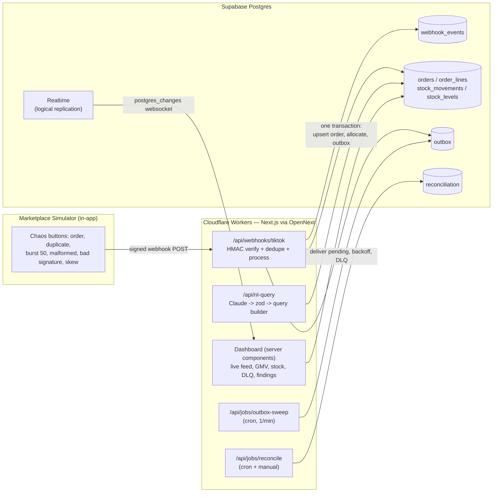
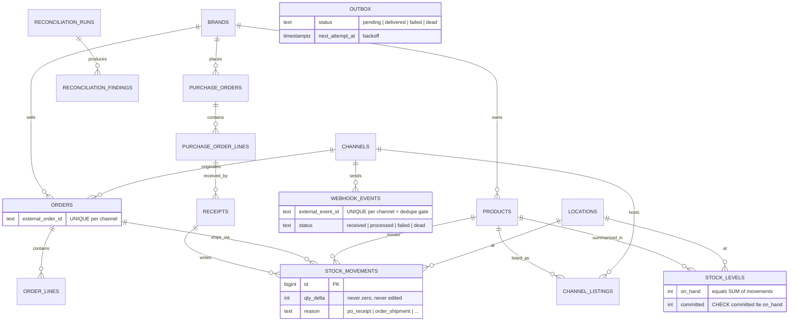
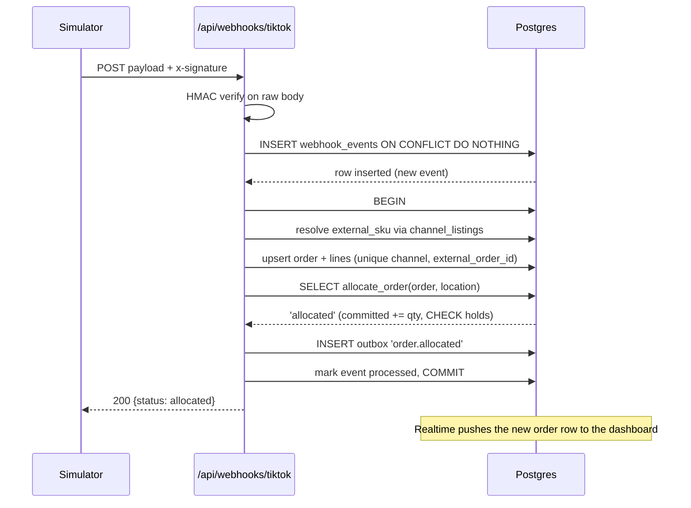
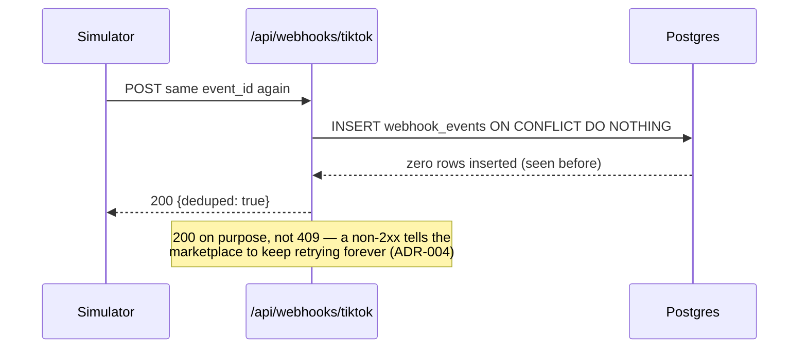
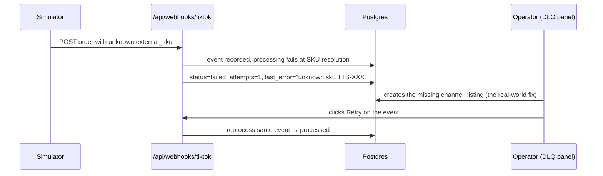
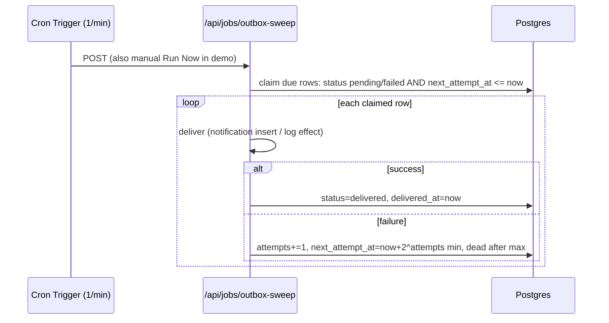

# Commerce OS — Architecture

Top-to-bottom system design. Diagrams are Mermaid and render natively on GitHub.
Companion docs: `docs/adr/` for why each decision was made, `docs/technology-primer.md`
for the technology-by-technology mapping.

---

## 1. System context

One sentence per box when you present this: the simulator plays TikTok Shop, the
webhook route is the hardened front door, Postgres holds all truth and all domain
logic, cron routes are the async layer, and the dashboard is a thin read layer
that gets pushed changes instead of polling.

---

## 2. Top-to-bottom layer walkthrough

### Layer 1 — UI (Next.js App Router, server-first)

Pages are React **server components**: they run on the server, query Supabase
read models directly with the service client, and ship rendered HTML. Only the
interactive islands are client components (`"use client"`): the live order feed
(Realtime subscription), the chaos button panel, the NL query bar, DLQ retry
buttons. This inverts the SPA model you know (React app fetching from FastAPI):
here the "backend for the frontend" is fused into the page itself.

### Layer 2 — API surface (route handlers)

Route handlers are Next.js's answer to FastAPI endpoints — plain functions
running inside the Worker (workerd) via OpenNext:

- `POST /api/webhooks/tiktok` — ingestion front door. Raw-body HMAC check,
  dedupe insert, then the processing transaction.
- `POST /api/jobs/outbox-sweep` — cron target. Claims due outbox rows, delivers,
  applies backoff, DLQs after max attempts. Re-entrant by design.
- `POST /api/jobs/reconcile` — calls the `run_reconciliation()` RPC.
- `POST /api/nl-query` — Claude call, zod validation, query builder.
- `POST /api/simulator/*` — payload factories that sign and fire webhooks at
  our own public URL (so the demo exercises the real path, not a shortcut).

### Layer 3 — Domain (Postgres functions)

`allocate_order`, `ship_order`, `receive_po_line`, `cancel_order`,
`run_reconciliation` live IN the database (see ADR-003). TypeScript
orchestrates; SQL decides. Reasons: the mutation and its invariant check are
one atomic unit, row locks live where the rows live, and no future code path
(bug, script, contractor) can bypass the rules by "forgetting" to use the
right service class.

### Layer 4 — Data (the two-books model)

The core mental model of the whole system — an accounting metaphor:

- **The journal**: `stock_movements`, append-only, every physical unit
  movement as an immutable row. A trigger makes UPDATE/DELETE a database error.
- **The account balance**: `stock_levels`, a fast rollup per product/location
  with `on_hand`, `committed`, and the firewall `CHECK (committed <= on_hand)`.
- **The audit**: `run_reconciliation()` proves journal and balance agree
  (internal drift) and compares our availability against what each marketplace
  last reported (external drift).

Physical events (receive, ship) write the journal and move `on_hand`.
Reservations (allocate, cancel) only move `committed` — nothing physical
happened yet, so nothing hits the journal. `available = on_hand - committed`
is always derived, never stored.

### Layer 5 — Async (outbox + cron)

Domain writes and their side-effect intents commit in one transaction — the
side effect is a row in `outbox`. A Workers Cron Trigger sweeps pending rows
once a minute, delivers them, and applies exponential backoff via `next_attempt_at`
until `dead`. This is the transactional outbox pattern from the incident
platform with the Kafka relay swapped for a cron sweep — same guarantee
(nothing lost between commit and publish), right-sized ops (see ADR-002).

#### Where is the worker layer?

Coming from a Kafka architecture, the natural question is: after the API
accepts work, what executes it? Here the worker layer is deliberately
dissolved into two places:

1. **The critical path runs inline, in the database.** Parse, dedupe, order
   upsert, `allocate_order()`, outbox write — all inside the webhook request,
   a few milliseconds of indexed SQL in one transaction. No handoff, because
   at this volume a handoff buys latency and moving parts, nothing else. The
   marketplace's own redelivery is the retry layer; idempotency gates make
   redelivery safe.
2. **Everything async is state in Postgres + stateless invocations.** The
   queue is a table, the offset is `status` + `next_attempt_at`, the DLQ is a
   status value, and the "worker" is a cron-fired isolate that claims due
   rows, delivers, and dies. Nothing is long-lived, so there is no graceful
   shutdown, no heartbeats, no rebalancing — the process holds no state
   worth protecting.

| Incident-platform concept | Commerce OS equivalent |
|---|---|
| Kafka topics | `outbox` + `webhook_events` tables |
| 8 consumer groups | 2 cron handlers (sweep, reconcile) |
| Long-lived workers, graceful shutdown | Ephemeral isolates, nothing to shut down |
| asyncio / threading / multiprocessing | async/await only; parallelism = more invocations; CPU-bound work → SQL now, Queue consumers later |
| Consumer offsets, rebalancing | `status` + `next_attempt_at`; atomic claims via `UPDATE … FOR UPDATE SKIP LOCKED RETURNING` |
| DLQ topic | `status = 'dead'` rows |

**Overlap answer:** double-fired sweeps are safe because deliveries are
idempotent; the hardening step is the atomic `SKIP LOCKED` claim above —
Postgres-as-queue done properly.

**When inline stops being right:** the moment per-order processing involves
external calls or a real time budget, the route flips to record → enqueue →
ack 200, with a consumer processing. The flip is cheap because idempotency
is already keyed at the event and order level.

**Evolution:** Cloudflare Queues consumers ≈ consumer groups (batching +
native DLQs, managed). Cloudflare Workflows ≈ durable execution — the
managed version of Incident Commander's hand-rolled checkpointed state
machine. Containers absorb CPU-heavy work at the far end, reading the same
outbox. The commit-then-relay contract never changes across any of these.

### Layer 6 — Realtime (push, not poll)

Supabase Realtime tails Postgres logical replication and pushes row changes
over websockets. The dashboard subscribes to `orders` inserts and
`stock_levels` updates. This one managed feature replaces the incident
platform's entire SSE + Redis pub/sub fan-out chain.

---

## 3. Entity relationships

The spine to draw at a whiteboard: **PO → receipt → journal → balance ←
order lines ← orders ← webhook events**, with outbox hanging off every
domain transaction.

---

## 4. Sequences

### 4.1 Order webhook, happy path

### 4.2 Duplicate delivery (the money shot of the demo)

Belt and suspenders: even if a duplicate slipped past the event gate under a
different event_id, the `orders (channel_id, external_order_id)` unique
constraint makes the order upsert a no-op — the same order can never allocate
stock twice.

### 4.3 Poison payload → DLQ → retry

This mirrors the #1 real ops incident in marketplace work: a listing goes
live on the marketplace before it exists in the system of record.

### 4.4 Outbox sweep

### 4.5 Oversell attempt

Order for qty 9,999 arrives → `allocate_order` runs the conditional update
`... AND on_hand - committed >= qty` → zero rows → exception → **plpgsql block
rollback releases any lines already reserved in this call** → order marked
`backordered` → outbox `order.backordered`. Nothing physical moved, the journal
is untouched, and even a hand-written UPDATE could not have oversold because
the CHECK constraint is the last line of defense (invariant test 4 proves this).

---

## 5. Failure modes and why each is safe

| Failure | What happens | Why it's safe |
|---|---|---|
| Marketplace delivers a webhook twice | Second insert hits unique constraint, no-op, 200 | Event-level dedupe (ADR-004) |
| Same order arrives under two event ids | Order upsert no-ops on (channel, external_order_id) | Order-level idempotency |
| Crash mid-processing after event recorded | Event stays `received`/`failed`, retried by sweep or manually | Processing is idempotent, safe to re-run |
| Crash between domain commit and side effect | Impossible state by construction | Side effect is an outbox row in the same transaction |
| Sweeper double-fires (cron overlap) | Both claim-and-deliver passes are idempotent | Re-entrant job design |
| Bug tries to over-reserve stock | Database error, transaction aborts | `CHECK (committed <= on_hand)` |
| Someone "fixes" a ledger row | Database error | Append-only trigger |
| Rollup drifts from journal (cosmic ray, bad migration) | Reconciliation flags `ledger_drift` with exact delta | Journal is truth; rollup is provably derived |
| Marketplace's stock number disagrees with ours | Reconciliation flags `channel_drift` per product/channel | External reports table + latest-wins compare |
| Claude emits a bad NL filter spec | zod rejects, one repair retry, then error to user | Model proposes, zod disposes (ADR-007) |

---

## 6. Scale path (the "what breaks at 10x/100x" answer)

Current design comfortably handles thousands of orders/day on a small Supabase
instance — which is why it's right for Platinum today (ADR-002, ADR-005).

- **10x**: add covering indexes for the dashboard's hottest queries; batch the
  outbox sweep; move GMV tickers to a materialized view refreshed by cron;
  partition `stock_movements` by month if the journal grows past ~10M rows.
- **100x**: swap the cron sweep for Cloudflare Queues (native batching and dead-letter
  queues, already on this platform); split ingestion into its own Worker; read replicas for dashboards;
  this is the point where the Kafka conversation from the incident platform
  becomes the right conversation, and not before.
- **Never needed here**: microservices, event sourcing with replay,
  multi-region writes. Say so out loud — knowing what NOT to build is the
  CTO signal.

---

## 7. Security model

- **Tenant isolation**: `brand_id` on every brand-scoped table; RLS policies
  scope reads by a `brand_id` JWT claim. The internal ops dashboard runs
  server-side with the service role (bypasses RLS by design); a future
  per-brand client portal authenticates as the brand and RLS does the rest.
  This is the multi-tenant model from the incident platform with Supabase's
  `auth.jwt()` as the claim source.
- **Ingestion auth**: HMAC-SHA256 over the raw request body with a per-channel
  shared secret, constant-time comparison. Invalid signatures are recorded
  (`signature_valid=false`, status `dead`) but never processed — visible in
  the DLQ so an attack attempt is observable, not silent.
- **Secrets**: service role key and webhook secrets exist only in server env
  (`wrangler secret` for deployed environments, `.dev.vars` locally, gitignored).
  The client bundle gets the anon key only.
- **SQL injection surface**: none by construction — supabase-js/PostgREST
  parameterizes,
  domain functions take typed arguments, and the NL feature never lets the
  model near SQL.
