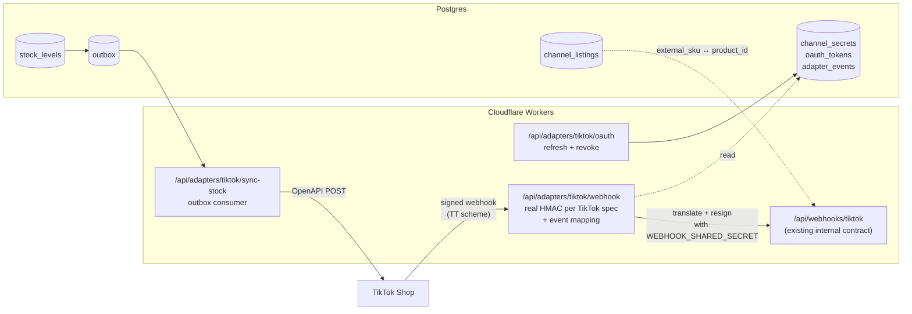

# Module 6.a — TikTok Shop Adapter

**Serves:** everyone — this is the wire that turns "the simulator plays TikTok" into "TikTok Shop is plugged in." · **Builds on:** the webhook contract from PR #1 (`WebhookPayload` in `lib/domain/webhook-schema.ts`), the ingestion pipeline (`process_order_event`), and the `channel_listings` translation table.

**One-liner from `ROADMAP.md`:** first real marketplace adapter. Every subsequent marketplace (Amazon, Walmart, eBay, Target+) is the same shape — this one sets the pattern.

---

## Success metrics

The module lands when:

1. Real TikTok Shop production orders flow into `orders` via `/api/adapters/tiktok/webhook` with zero manual entry.
2. Order status changes on TikTok (paid → refunded, shipped → delivered) update `orders.status` end-to-end within the same minute they land.
3. Our `available_to_sell` gets pushed to TikTok on `stock_levels` change (outbound sync), so listings don't oversell.
4. TikTok's OAuth token refreshes silently — no PagerDuty at 3am when the refresh window closes.

Adoption threshold: one full sales day where the simulator is unplugged and every order the ops dashboard shows came from TikTok's actual API.

---

## What's out of scope (upstream, not engineering)

Named up front because the interview walk should acknowledge these honestly:

- **Partner registration.** TikTok Shop's Partner Center approval typically takes 4-6 weeks and requires business docs. Not an engineering task; work should start in parallel with M1 planning.
- **Sandbox credentials.** Adapter development can start against TikTok's sandbox once partner status is provisioned.
- **Category-specific compliance** (e.g., electronics, food, cosmetics have extra fields). Add per category as they matter to Platinum's mix.

---

## Architecture — this side of the wire



The clean move: TikTok's inbound webhooks land at `/api/adapters/tiktok/webhook`, which translates the TikTok payload into our internal `WebhookPayload` shape and forwards to the existing `/api/webhooks/tiktok`. Two boundaries, one contract in the middle. Every future marketplace does the same shape.

---

## Schema additions

Additive migration. Three new tables.

### `channel_secrets`
Per-channel HMAC secrets, API keys, webhook signing keys. Rotates without a code change. Postgres RLS locks this to `service_role`; not exposed to any client.

```sql
create table channel_secrets (
  id             uuid primary key default gen_random_uuid(),
  channel_id     text not null references channels(id),
  purpose        text not null check (purpose in
                   ('webhook_hmac','api_client_id','api_client_secret','webhook_shared_secret')),
  encrypted_value text not null,       -- pgsodium or app-side encrypted; NEVER plaintext
  effective_from timestamptz not null default now(),
  effective_until timestamptz,
  created_at     timestamptz not null default now(),
  unique (channel_id, purpose, effective_from)
);
```

Migration also adds a helper view `active_channel_secret(channel_id, purpose)` that returns the latest effective row.

### `oauth_tokens`
Per-channel OAuth state. TikTok Shop uses OAuth 2.0 with refresh tokens (access token typically 2 hours, refresh token 30 days). Same shape works for every marketplace that follows OAuth 2.0.

```sql
create table oauth_tokens (
  id             uuid primary key default gen_random_uuid(),
  channel_id     text not null references channels(id),
  merchant_id    text not null,                    -- our shop id on their platform
  access_token   text not null,                    -- store encrypted; here for shape
  refresh_token text not null,
  scope          text,
  access_expires_at  timestamptz not null,
  refresh_expires_at timestamptz not null,
  created_at     timestamptz not null default now(),
  updated_at     timestamptz not null default now(),
  unique (channel_id, merchant_id)
);
```

Access + refresh tokens are encrypted at rest (Postgres `pgsodium` extension if available, else app-side envelope encryption using a KMS key stored as a Worker secret).

### `adapter_events`
Every inbound adapter delivery gets a row here BEFORE translation. Preserves the raw TikTok payload for audit + re-translation if we later fix a bug in the mapping. Similar to `webhook_events` but ONE step upstream — this captures what came from the marketplace, `webhook_events` captures what we sent to our own pipeline.

```sql
create table adapter_events (
  id                   uuid primary key default gen_random_uuid(),
  channel_id           text not null references channels(id),
  adapter_event_id     text not null,               -- their event id
  received_at          timestamptz not null default now(),
  raw_payload          jsonb not null,
  raw_signature        text,
  translation_status   text not null default 'received'
                       check (translation_status in ('received','translated','failed')),
  translation_error    text,
  emitted_event_id     text,                        -- link to webhook_events.external_event_id
  unique (channel_id, adapter_event_id)
);
```

The `UNIQUE (channel_id, adapter_event_id)` is our first-line dedupe against TikTok redelivering. `webhook_events` still dedupes at OUR contract level, so we have belt-and-suspenders — TikTok can rename its event ids, we still dedupe on ours.

---

## Domain functions

**`register_tiktok_secret(purpose, value)`** — writes to `channel_secrets` with encryption + expires the previous active row. Called by an ops-only settings page or a CLI script during initial setup.

**`translate_tiktok_event(payload)` (SQL)** — pure function. Takes the raw TikTok jsonb, returns our `webhook_payload` jsonb shape. Written as a SQL function (not plpgsql) so it's inlinable + testable in isolation. If the payload shape can't be translated, raises a specific exception the route handler catches and marks `adapter_events.translation_status = 'failed'`.

Called only by the adapter route — the internal contract stays the source of truth for the domain functions.

---

## Adapter route: `/api/adapters/tiktok/webhook`

Pipeline (each step idempotent):

1. **HMAC verify** against `channel_secrets(channel_id='tiktok_shop', purpose='webhook_hmac')`. TikTok's signing scheme is `SHA256(secret + url_path + query_string + body + timestamp)` — different from our internal `HMAC-SHA256(secret, body)`. Route handles TikTok's shape; internal contract stays clean.
2. **Insert into `adapter_events`** with `ON CONFLICT DO NOTHING`. Same dedupe pattern as `webhook_events`.
3. **Translate** via `translate_tiktok_event(payload)`. On failure: mark `translation_status='failed'`, return 200 (marketplaces retry non-2xx forever), event is visible in a new `/adapter/dlq` view.
4. **Re-sign** the translated payload with our own `WEBHOOK_SHARED_SECRET` and POST to `/api/webhooks/tiktok`. Yes, the Worker calls itself — the same pattern the chaos simulator uses (PR #3). This keeps the internal contract sacred: nothing bypasses `webhook_events` + `process_order_event`.
5. **Mark** `adapter_events.translation_status = 'translated'`, `emitted_event_id = <our event_id>`, and mirror the internal response.

Failure to reach the internal route is retried with backoff via `outbox` (or a small retry queue). Not fire-and-forget.

---

## Outbound stock sync: `/api/adapters/tiktok/sync-stock`

When `stock_levels` changes for a product that has a `channel_listings` row on `tiktok_shop`, we owe TikTok an update to their inventory count. Otherwise their listing shows quantity we don't have and they oversell for us.

Wire:

1. Trigger on `stock_levels` update writes an outbox row `stock.updated` with `product_id, location_id, on_hand, committed`.
2. Existing outbox sweeper (from PR #1) delivers to `/api/adapters/tiktok/sync-stock`.
3. Sync route reads `channel_listings` for the product on `tiktok_shop`, looks up `oauth_tokens`, calls TikTok's inventory update API with `available = on_hand - committed`.
4. On 401/403: refresh token, retry once, then DLQ if still failing.
5. On 5xx: outbox retry with backoff.

The sync is **channel-scoped** — inventory changes for a product listed on Amazon also outbox `stock.updated`, but Amazon's own adapter would consume it. Adapters don't cross channels.

---

## OAuth token refresh: `/api/adapters/tiktok/oauth`

- **Initial connect**: ops clicks "Connect TikTok Shop" on `/settings/adapters`. Opens TikTok's OAuth consent page. Redirect back with authorization code. Route exchanges code for tokens, stores in `oauth_tokens`.
- **Refresh**: cron (every 30 min) checks `oauth_tokens` where `access_expires_at < now() + interval '1 hour'`. Calls TikTok's refresh endpoint. Updates row.
- **Revoke**: ops action. Deletes the row + calls TikTok's revoke endpoint.

Cron uses the same separate `cron-worker/` from PR #4 — small addition, one more scheduled endpoint.

---

## PR breakdown

### PR M6a-A: schema + secret management (~500 LOC)
- Migration 010: `channel_secrets`, `oauth_tokens`, `adapter_events`, `active_channel_secret` view.
- `lib/adapters/tiktok/secrets.ts` — encrypted-at-rest read/write helpers.
- `/settings/adapters` page with a "Connect TikTok Shop" button (stubbed OAuth flow initially).
- ADR-010: adapter pattern (why the two-hop wire, not a single route).
- Integration tests: secret rotation, adapter_events dedupe.

### PR M6a-B: inbound webhook adapter (~700 LOC)
- Migration 011: `translate_tiktok_event(payload)` SQL function.
- `/api/adapters/tiktok/webhook` route.
- `lib/adapters/tiktok/hmac.ts` — TikTok-specific signing.
- `lib/adapters/tiktok/translate.ts` — pure TS translation using the SQL function + zod.
- `/adapter/dlq` page: adapter events with `translation_status='failed'`.
- Integration tests: sample TikTok payloads (order.created, order.cancelled, order.paid, order.refunded) → correct internal shape.

### PR M6a-C: OAuth + outbound stock sync (~600 LOC)
- OAuth connect + refresh flow with cron.
- `/api/adapters/tiktok/sync-stock` outbox consumer.
- Trigger on `stock_levels` update → outbox `stock.updated`.
- Integration: mock TikTok API server (Vitest MSW) → assert sync request shape.

### PR M6a-D: production cutover + observability (~300 LOC)
- Grafana / Sentry hooks around adapter volume + latency.
- Simulator's Send-order button gains a "Also send via TikTok adapter path" toggle so QA can exercise both routes side by side.
- Runbook doc: how to rotate secrets, how to revoke, how to interpret DLQ.

Total: ~2,100 LOC across 4 PRs.

---

## Testing

- **Round-trip**: sample real TikTok webhook payload (recorded from sandbox) → adapter → internal webhook → correct `orders` row + `stock_levels` update.
- **Signature failure**: intentionally corrupt signature → 401, event NOT translated, adapter_events row visible in DLQ.
- **Duplicate delivery** at both levels: same TikTok event id twice (adapter_events dedupe), then same event id under a different TikTok id but same order (webhook_events / orders dedupe).
- **Token refresh**: cron fires with a token expiring in 45 min → refresh succeeds → next inbound call sees new token.
- **Stock sync retry**: mock TikTok returning 500 → outbox row retries with backoff → eventually delivers or DLQs.

---

## Deliberate deferrals

- **Real payout/settlement ingest.** That's Module 5.
- **Listing creation via API.** Push our catalog TO TikTok. Deferred to Module 6.b (Amazon), which needs it more urgently; TikTok listings are often created manually anyway.
- **Product catalog sync.** Same reason.
- **Analytics API pulls** (product performance, ad performance). Deferred to Module 4 (Performance Intelligence metrics spine).

---

## Open questions

1. **Encryption at rest for tokens.** `pgsodium` extension gives per-row encryption inside Postgres; Cloudflare Secrets Manager is another option. Recommendation: `pgsodium` — one system, easier to rotate.
2. **Webhook idempotency window.** TikTok might redeliver an event days later after our unique index is already the source of truth. Fine — dedupe still works. But should we ever expire old `adapter_events` rows? Yes — after 90 days, move to a compressed archive table. Not blocking.
3. **Multi-shop support.** One Platinum brand could own multiple TikTok Shop merchant IDs (per region, per brand). `oauth_tokens.merchant_id` supports this, but the UI for switching between them is deferred until it's actually needed.

---

## Landed

_This section fills in with merged PR numbers as they land._
