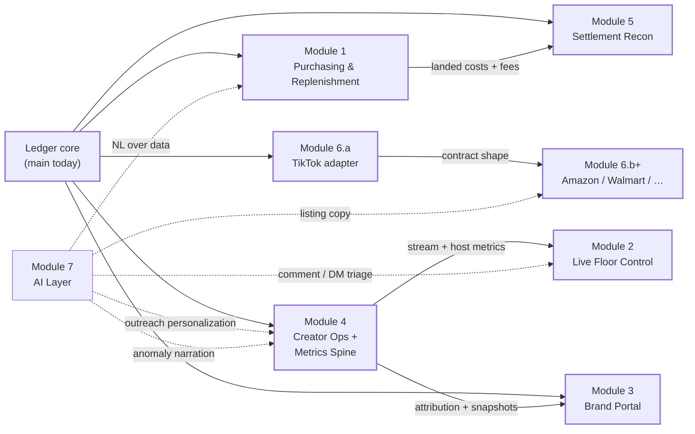

# Next Phases — Execution Plans

The five-day interview build (`main`, PRs #1-#4) delivers the ledger core, ingestion pipeline, ops dashboard, chaos simulator with reconciliation + NL query, and demo-day polish. That is the **foundation**, not the product.

This directory takes `ROADMAP.md` — which frames the seven modules and their business case — and turns each into an **executable plan**: what schema changes, what routes, what components, in what order, gated by which invariants. Each doc is written so a future engineer (or a subcontractor) can pick it up and start a branch without a second briefing.

---

## Sequencing map

The sequencing follows `ROADMAP.md`'s own suggested order, chosen to satisfy one hard rule: **every quarter ships something a named person uses daily, and nothing is built twice — each module compounds on the ledger rather than beside it.**

| Phase | Modules | Named user | Why now |
|---|---|---|---|
| **Q1** | [01 Purchasing & Replenishment](./01-purchasing-replenishment.md) + [02 TikTok Shop adapter](./02-tiktok-shop-adapter.md) | Purchasing lead · account managers | Kills the manual receiving ledger AND turns the simulator real — the two "must-have" gaps in the current demo become real code. |
| **Q2** | [03 Creator & Affiliate Ops + Metrics Spine](./03-creator-affiliate-ops.md) + [04 Live Floor Control Room](./04-live-floor-control.md) | Affiliate managers, sample center · Live producers, hosts | The two most Platinum-shaped things software can do here. Module 4's metrics spine also feeds Module 2's boards — order matters. |
| **Q3** | [05 Brand Portal](./05-brand-portal.md) + [06 Settlement Reconciliation](./06-settlement-reconciliation.md) | Brand clients + AMs · Finance/ownership | Both are retention plays. Portal turns the multi-tenant model into revenue defense; settlement finds ~0.5% of ~$100M GMV that's silently leaking. |
| **Q4+** | [07 Marketplace Expansion](./07-marketplace-expansion.md) (Amazon, Walmart, eBay, Target+) | Everyone | Each new marketplace is one adapter PR against interfaces that already exist. Sequenced by revenue potential per adapter. |
| **Continuous** | [08 AI Layer pattern](./08-ai-layer.md) | Every team | Not a module — a pattern. Lands inside each of the above (listing copy generation for 06, outreach personalization for 03, comment/DM triage for 02, anomaly narration for 04). |

Every module below is broken into PR-sized chunks of ~300-800 LOC each (per the workflow rule in `docs/engineering-workflow.md`), with the first PR of each module usually schema + read layer, then domain functions, then UI, then polish + tests.

---

## Dependency graph

Hard dependencies (solid arrows) are the ones that would force reordering. Soft dependencies (dotted arrows to M7) reflect "the AI layer LANDS in this module" — no blocking, just a checkpoint.

**Cannot start Module 2 until Module 4's metrics spine ships.** The live control room's per-bay boards read `stream_snapshots`, `stream_segments`, and derived views that only exist inside Module 4. Building Module 2 first means either duplicating the schema (wrong per the sequencing principle) or wrangling metrics twice.

**Cannot start Module 3 until Module 4's attribution exists.** A brand portal that doesn't show attributed GMV (which orders came from which creator) misses the most important number brand clients want. Portal without attribution is a data-lite dashboard, not a retention feature.

**Everything else can start anytime after the ledger core** — but the sequence in the map above is what makes each quarter's PR chain compound rather than compete.

---

## Common patterns applied across every module

Every module below inherits the same discipline the demo built. Repeated so nobody has to re-derive it:

**Schema-first.** Every module opens with a migration PR: new tables, RLS policies, indexes, views. Migrations are additive-only; never edit an applied migration. Regenerate types after every migration (`pnpm gen:types`). Every table joins to `brand_id` (directly or via foreign key) so the multi-tenant boundary follows the data.

**Domain in the database.** Multi-row mutations under invariants live in plpgsql functions (ADR-003) — `receive_shipment`, `apply_creator_attribution`, `resolve_settlement_line`, etc. TypeScript orchestrates; SQL decides. Row locks (`FOR UPDATE`), stable lock ordering, and inner exception blocks live next to the rows they protect.

**Reads are views.** Every dashboard number sourced from a named SQL view (not composed in TS). This makes "what number is that" answerable with a five-line CTE that a demo audience can read. Naming pattern: `<subject>_dashboard`, `<subject>_summary`, `open_<items>`, `recent_<items>`.

**Every boundary is zod.** Webhook payloads, NL specs, env vars, adapter inputs, route bodies. `.strict()` on any object the model or an external system controls.

**Idempotency by construction.** Any inbound event that could be retried gets a natural unique key + `ON CONFLICT DO NOTHING` at the door. Any outbound side effect goes through the outbox pattern from PR #1 — never a fire-and-forget from a route handler.

**Money is integer cents. Timestamps are `timestamptz`, UTC.** Full stop, every module.

**RLS from day one on new tables.** Even if the current sprint only reads via `service_role`, adding brand-scoped policies at table creation costs nothing and locks in the boundary before Module 3 needs it.

**PRs are substantial (~300-800 LOC).** Bundle schema + RPC + query + a UI slice + tests in one review-able unit. Small drive-by PRs are the anti-pattern (per [[feedback-pr-style]]).

**PR bodies carry the full context** (per [[feedback-pr-descriptions]]) — file-by-file walk, invariants checklist, test evidence, design decisions, deliberate deferrals. Reads like a design doc.

---

## Cross-cutting infrastructure to add early

Two capabilities aren't in `ROADMAP.md` per se but are prerequisites for most modules below. Land them opportunistically inside the first module that needs each:

**Ops auth + session-gated routes.** Currently `/api/dlq/retry`, `/api/reconciliation/*`, `/api/simulator/*`, `/api/nl-query` are unauthenticated (fine for the demo, wrong for production). First module that adds any operator write path (Module 1's receive UI) also adds Supabase Auth session gating in the same PR. Retro-fits every existing operator route in the same landing.

**Preview versions per PR.** `wrangler versions upload` runs on every PR and posts the preview URL as a check. Currently deferred from PR #1-#4. Land it as a small `chore(ci): per-PR preview deployments` before Module 1 so every feature PR ships a walkable URL.

Both are ~150-300 LOC additions; not their own module, but named here so they don't get forgotten.

---

## Milestones

- **End of Q1**: manual receiving ledger retired; real TikTok Shop webhooks flowing through the same code path the simulator built.
- **End of Q2**: creator/affiliate CRM live for AMs; per-bay live control boards in one studio for pilot; metrics spine feeding both.
- **End of Q3**: three brands using the portal for their weekly readouts; settlement recon flagging ≥0.5% of GMV leakage per month.
- **End of Q4**: Amazon adapter shipping orders through the same contract; two additional marketplaces staged.

Every milestone hits the "named person uses daily" bar — no vanity metrics.

---

## How to use these docs

For each module:

1. Read the spec top to bottom before cutting the first branch.
2. Follow the PR sequence — each PR is designed to leave `main` green and demoable.
3. Update the spec's "Open questions" section if a design call comes up during the build. Answered questions become PR-body notes; unanswered ones stay in the spec.
4. When the module is done, add a "Landed" section to its spec pointing at the merged PR numbers. That's the audit trail.
